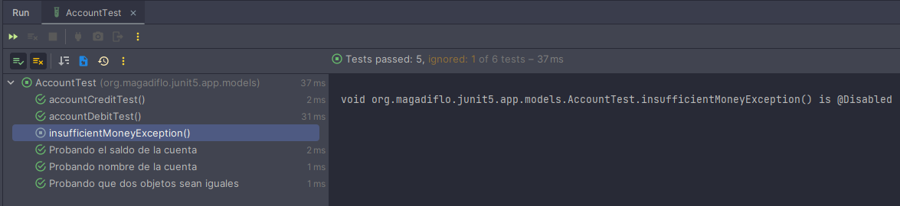
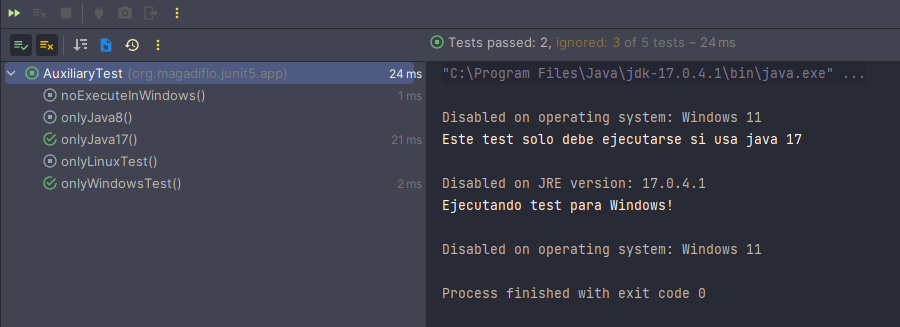

# JUnit 5

---

## Creando y configurando el proyecto con JUnit 5

Creamos un proyecto java con maven desde nuestro ide IntelliJ IDEA. Luego **agregamos la dependencia de JUnit 5:**

````xml

<dependencies>
    <dependency>
        <groupId>org.junit.jupiter</groupId>
        <artifactId>junit-jupiter</artifactId>
        <version>5.9.0</version>
        <scope>test</scope>
    </dependency>
</dependencies>
````

**NOTA**

- Al momento de seleccionar las dependencias puede que nos encontremos con las siguientes:
    - **junit-jupiter-api:** api para desarrollar los test unitarios con junit.
    - **junit-jupiter-engine:** es el plataform, el motor que se encargará de ejecutar las pruebas.
    - **junit-jupiter:** esta es la dependencia que elegimos para nuestro proyecto, ya que contiene las dos dependencias
      anteriores.
- En la dependencia de JUnit 5 en el **scope** se colocó en automático **test**, esto indica que la dependencia es
  necesaria exclusivamente para ejecutar las pruebas, pero no para usar el proyecto. Un ejemplo de dependencia con scope
  test es JUnit, que se usa para las pruebas, pero no es necesaria para que nuestro proyecto funcione.
- Estamos trabajando con la versión 17 de java.

## Creando la clase que usaremos para hacer pruebas

Crearemos nuestra clase Account (Cuenta) con los atributos person y balance (saldo):

````java
public class Account {
    private String person;
    private BigDecimal balance;

    /* getters and setters */
}
````

## Escribiendo y ejecutando primeras pruebas unitarias con Assertions

Crearemos una **clase de test** para nuestra clase **Account**, podemos hacerlo de forma manual, pero aprovecharemos el
IDE de IntelliJ IDEA para crear en automático nuestra clase de prueba, para eso debemos posicionarnos **dentro de la
clase que queremos probar** y presionar las siguientes teclas:

````
Ctrl + Shift + T
````

La combinación anterior puede hacer lo siguiente:

- Creará una clase test a partir de la clase base (el puntero del mouse debe estar dentro de la clase base).
- Si la clase test ya fue creada y tiene al menos un método de test, permite ir desde esa clase test hacia la clase
  base.
- Si estamos en la clase base, podemos ir a la clase test o crear un nuevo test para la clase base.

Al crear nuestra clase test de manera automática **(Ctrl + shift + T)** la clase de prueba creada se vería así:

````java
import static org.junit.jupiter.api.Assertions.*;

class AccountTest {

}
````

Observamos una importación estática que se hizo al crear automáticamente la clase de prueba
``import static org.junit.jupiter.api.Assertions.*;``, esta importación no permitirá utilizar los distintos métodos
estáticos que JUnit nos provee para realizar las pruebas como por ejemplo: ``assertEquals(...), assertTrue(...),
assertThrows(...), etc``.

Crearemos un método de prueba llamado **accountNameTest**, para eso presionamos:

````
Alt + insert
Seleccionamos Test Method
````

````java
class AccountTest {
    @Test
    void accountNameTest() {

    }
}
````

**NOTA**

> Por buenas prácticas tanto la clase como los métodos **deben tener un método de acceso del tipo package (default)**,
> es por eso que vemos que se escribe directamente la clase: ``class AccountTest{}`` y no un
> ``public class AccountTest{}``, lo mismo con el método. Esto es porque las pruebas deberían poder ser accedidas
> únicamente desde el contexto de ejecución de test.

## Creando nuestra primera prueba

Para crear nuestra primera prueba, vamos a agregar un constructor a nuestra clase **Account** quien recibirá dos
parámetros **person y balance**. El parámetro **balance** lo asignaremos al atributo privado de la clase, mientras que
**intencionalmente el parámetro person no será asignado al atributo person de la clase**:

````java
public class Account {
    private String person;
    private BigDecimal balance;

    public Account(String person, BigDecimal balance) {
        this.balance = balance;
    }
    /* Getters and setters */
}
````

Entonces en nuestro método test crearemos un objeto **Account("Martín", new BigDecimal("2000"))** y debemos comprobar
que el método **getPerson()** nos retorne el valor de **Martín**, porque es lo que estamos pasando por parámetro, pero
como intencionalmente **NOS HEMOS OLVIDADO** de asignar el parámetro al atributo, es que la prueba debe fallar:

````java
class AccountTest {
    @Test
    void accountNameTest() {
        Account account = new Account("Martín", new BigDecimal("2000"));

        String expected = "Martín";
        String real = account.getPerson();

        assertEquals(expected, real);
    }
}
````

Para ejecutar el test presionamos: ``Ctrl + Shift + F10``

````bash
org.opentest4j.AssertionFailedError: 
Expected :Martín
Actual   :null
````

Para corregir el error debemos ir a la clase base y ver el constructor **¡Ohh! Me olvidé de asignar el parámetro
person al atributo person**, lo corregimos y volvemos a ejecutar el test:

````java
public class Account {
    private String person;
    private BigDecimal balance;

    public Account(String person, BigDecimal balance) {
        this.person = person; // <----- ya corregido
        this.balance = balance;
    }
    /* Getters and Setters */
}
````

Ejecutamos nuevamente el test y vemos que **esta vez pasa la prueba.**

## Escribiendo test para el balance (saldo)

````java
class AccountTest {
    @Test
    void balanceAccountTets() {
        Account account = new Account("Martín", new BigDecimal("2000"));

        assertEquals(2000D, account.getBalance().doubleValue());            //(1)
        assertFalse(account.getBalance().compareTo(BigDecimal.ZERO) == -1); //(2)
        assertTrue(account.getBalance().compareTo(BigDecimal.ZERO) == 1);   //(3)
    }
}
````

**DONDE**

- **(1)**, verificamos que el saldo del objeto account sea igual al saldo esperado (2000). Como el tipo de dato del
  saldo es un BigDecimal, una forma de hacer la comparación es convirtiéndolo en un double.
- **(2)**, debe ser falso que el saldo de la cuenta sea menor que 0. El método **compareTo()** nos da 3 posibles
  valores, si el primer término es menor que (-1), si son iguales (0), pero si el primer término es mayor que (1).
- **(3)**, debe ser verdadero que el saldo es mayor que 0.

---

## Test Driven Development (TDD) con JUnit

Con TDD, primero creamos las pruebas luego implementamos la solución. Como primer ejemplo realizaremos un test que
compare dos objetos con los mismos valores, pero la comparación lo haremos por referencia:

````java
class AccountTest {
    @Test
    void referenceAccountTest() {
        Account account1 = new Account("Liz Gonzales", new BigDecimal("2500.00"));
        Account account2 = new Account("Liz Gonzales", new BigDecimal("2500.00"));

        assertNotEquals(account2, account1);
    }
}
````

El test anterior pasará la prueba, ya que **account1** y **account2** tienen referencias distintas, es decir, apuntan a
distintas direcciones de memoria.

Ahora, supongamos que las reglas del negocio cambian y nos piden comparar los dos objetos por valor, en esos términos,
ambos objetos son iguales, ya que contienen los mismos valores.

````java
class AccountTest {
    @Test
    void valueAccountTest() {
        Account account1 = new Account("Liz Gonzales", new BigDecimal("2500.00"));
        Account account2 = new Account("Liz Gonzales", new BigDecimal("2500.00"));

        assertEquals(account2, account1);
    }
}
````

Al hacer el test anterior, y sin haber modificado nada, la prueba va a fallar, ya que a pesar de que estamos tratando de
comparar por valor, en realidad se están comparando por referencia como en el **referenceAccountTest()**, el mensaje que
nos muestra es:

````bash
org.opentest4j.AssertionFailedError: 
Expected :org.magadiflo.junit5.app.models.Account@6a396c1e
Actual   :org.magadiflo.junit5.app.models.Account@6c3f5566
````

Entonces, la idea es que cuando hagamos las pruebas así tengamos objetos que apunten a direcciones de memorias distintas
(referencia), mientras los objetos tengan los mismos valores en sus atributos, nos deberá mostrar que son iguales. Por
defecto la comparación se hace por objeto, es decir por instancia o referencia de memoria. Si sobreescribimos el método
**equals()** veremos, como se mencionó, la comparación por objeto:

````java
public class Account {
    /* omitted code */
    @Override
    public boolean equals(Object obj) {
        return super.equals(obj);
    }
}

````

Para poder hacer la comparación por valor, debemos modificar el método **equals()**. Podemos usar el mismo IntelliJ IDEA
para que nos genere el método implementado **equals()**:

````java
public class Account {
    /* omitted code */
    @Override
    public boolean equals(Object o) {
        if (this == o) return true;
        if (o == null || getClass() != o.getClass()) return false;
        Account account = (Account) o;
        return Objects.equals(person, account.person) && Objects.equals(balance, account.balance);
    }
}
````

Como sobreescribimos el método **equals()** de la clase **Account**, ahora el test **valueAccountTest()** va a pasar,
puesto que ahora la comparación la hará **por valor** y no por referencia. **¿Y qué pasa con el test
referenceAccountTest()?**, bueno este test va a fallar, porque ahora ya no estamos comparando por referencia, sino por
valor, así que lo eliminamos del archivo de prueba y solo nos quedamos con el **valueAccountTest()**.

## TDD para débito y crédito

Coma aplicaremos **TDD**, primero crearemos nuestros dos métodos en la clase **Account** que serán probadas:

````java
public class Account {
    /* omitted code */

    public void debit(BigDecimal amount) {

    }

    public void credit(BigDecimal amount) {

    }
    /* omitted code */
}
````

Los dos métodos anteriores están **sin implementar**, ahora toca crear las pruebas que verifiquen dichos métodos, ese
es el objetivo de **TDD**, crear las pruebas y luego implementar los métodos. Nuestra primera prueba verifica el método
**debit()** y el segundo el método **credit()**:

````java
class AccountTest {
    @Test
    void accountDebitTest() {
        Account account = new Account("Martín", new BigDecimal("2000"));
        account.debit(new BigDecimal("100")); //<-- ejecutamos el método a probar

        assertNotNull(account.getBalance());
        assertEquals(1900D, account.getBalance().doubleValue());
        assertEquals("1900", account.getBalance().toPlainString());
    }

    @Test
    void accountCreditTest() {
        Account account = new Account("Martín", new BigDecimal("2000"));
        account.credit(new BigDecimal("100")); //<-- ejecutando el método a probar

        assertNotNull(account.getBalance());
        assertEquals(2100D, account.getBalance().doubleValue());
        assertEquals("2100", account.getBalance().toPlainString());
    }
}
````

En el caso del método **debit()**, lo que debería pasar es que internamente se debería **restar el balance(saldo)
correspondiente a la cuenta** y bueno como resultado ya no debería haber **2000** sino **1900**. Pero como aún no
tenemos implementada dicho método, el test fallará.

````bash
org.opentest4j.AssertionFailedError: 
Expected :1900.0
Actual   :2000.0
````

Lo mismo ocurrirá con el método **credit()**, lo que debería pasar internamente es que se debería **sumar el balance
(saldo) correspondiente a la cuenta** y como resultado debería haber **2100**, pero como tampoco tenemos implementado
dicho método, el test fallará.

````bash
org.opentest4j.AssertionFailedError: 
Expected :2100.0
Actual   :2000.0
````

Implementamos los métodos de la clase **Account**:

````java
public class Account {
    public void debit(BigDecimal amount) {
        this.balance = this.balance.subtract(amount);
    }

    public void credit(BigDecimal amount) {
        this.balance = this.balance.add(amount);
    }
}
````

**Volvemos a ejecutar las pruebas** y esta vez veremos que todas las pruebas pasan, esto ocurre porque ya estamos
actualizando el valor del atributo balance con el amount que nos pasan por parámetro. Si es **debit = restar,** pero si
es **credit = sumar**.

## Probando y afirmando excepciones con assertThrows en JUnit 5

Simularemos la ocurrencia de una excepción cuando se llame al método **debit()** y se reste el balance (saldo), cuando
el balance tenga un valor negativo, entonces lanzaremos la excepción **InsufficientMoneyException**. Para eso, creamos
primero nuestra excepción:

````java
public class InsufficientMoneyException extends RuntimeException {
    public InsufficientMoneyException(String message) {
        super(message);
    }
}
````

Nuevamente, como estamos usando **TDD** crearemos el test para verificar si el método **debit()** lanza la excepción
**InsufficientMoneyException** cuando el amount que se le pasa por parámetro es más de lo que puede restar.

````java
class AccountTest {
    @Test
    void insufficientMoneyException() {
        Account account = new Account("Martín", new BigDecimal("2000"));

        InsufficientMoneyException exception = assertThrows(InsufficientMoneyException.class, () -> {
            account.debit(new BigDecimal("5000")); //<-- Método que lanza la excepción
        });

        assertEquals(InsufficientMoneyException.class, exception.getClass());
        assertEquals("Dinero insuficiente", exception.getMessage());
    }
}
````

Si ejecutamos el test anterior, la prueba fallará, ya que aún no tenemos implementado el lanzamiento de la excepción:

````bash
org.opentest4j.AssertionFailedError: Expected org.magadiflo.junit5.app.exceptions.InsufficientMoneyException to be thrown, but nothing was thrown.
````

Implementamos el método **debit()** para lanzar la excepción personalizada:

````java
public class Account {
    /* omitted code */
    public void debit(BigDecimal amount) {
        BigDecimal newBalance = this.balance.subtract(amount);
        if (newBalance.compareTo(BigDecimal.ZERO) < 0) {
            throw new InsufficientMoneyException("Dinero insuficiente");
        }
        this.balance = newBalance;
    }
    /* omitted code */
}
````

Ahora podemos ejecutar el test que creamos al inicio para verificar el lanzamiento de esta excepción. **Como resultado
observaremos que el test pasa,** eso significa que implementamos correctamente el lanzamiento de la excepción.

**NOTA**

Podemos agregar un mensaje propio a nuestro **assertThrows()**, del tal forma que cuando falle la excepción veamos en
pantalla nuestro mensaje, por ejemplo:

````java
class AccountTest {
    @Test
    void insufficientMoneyException() {
        Account account = new Account("Martín", new BigDecimal("2000"));

        InsufficientMoneyException exception = assertThrows(InsufficientMoneyException.class, () -> {
            account.debit(new BigDecimal("5000"));
        }, "Se esperaba que InsufficientMoneyException fuera lanzado"); //<-- Nuestro mensaje a mostrar cuando falle

        assertEquals(InsufficientMoneyException.class, exception.getClass());
        assertEquals("Dinero insuficiente", exception.getMessage());
    }
}
````

## Añadiendo la clase Banco y la relación con las cuentas

Creamos un nuevo modelo **Bank** donde crearemos un método a probar **transfer()**. Como estamos aplicando TDD, por
ahora no implementamos el método, sino primero tenemos que definir nuestra prueba para ese método.

````java
public class Bank {
    private String name;

    /* Bank getters and getters */

    public void transfer(Account origen, Account destinate, BigDecimal amount) {
        // TODO por implementar
    }
}
````

Ahora, podemos crear el método de prueba en la misma clase **AccountTest** (así lo hace en el tutorial), pero hacer más
limpio el trabajo, crearé una nueva clase de prueba llamada **BankTest**, ya que precisamente esa prueba le corresponde
a la clase **Bank**.

````java
class BankTest {

    @Test
    void transferTest() {
        Account origen = new Account("Martín", new BigDecimal("2000.50"));
        Account destinate = new Account("Alicia", new BigDecimal("1500.50"));

        Bank bank = new Bank();
        bank.setName("Banco BBVA");

        bank.transfer(origen, destinate, new BigDecimal("500.50"));

        assertEquals(1500D, origen.getBalance().doubleValue());
        assertEquals(2001D, destinate.getBalance().doubleValue());
    }
}
````

Si ejecutamos el método **transferTest()** veremos que fallará la prueba porque estamos usando TDD, es decir, primero
acabamos de implementar el test, pero aún no tenemos implementado el método real:

````bash
org.opentest4j.AssertionFailedError: 
Expected :1500.0
Actual   :2000.5
````

Entonces, la implementación de nuestro método **transfer()** debería hacer que pase la prueba anterior.

````java
public class Bank {
    private String name;

    /* Bank getters and setters */

    public void transfer(Account origen, Account destinate, BigDecimal amount) {
        origen.debit(amount);
        destinate.credit(amount);
    }
}
````

Ahora si tenemos implementada el método real, ejecutamos la prueba nuevamente y esta vez ya debería pasarla.

## Probando y afirmando las relaciones entre Bank y Account

Debemos agregar el atributo List<Account> en Bank y el atributo Bank en Account:

````java
public class Bank {
    private String name;
    private List<Account> accounts = new ArrayList<>(); //<-- importante inicializarlo sino lanzaría un NullPointerExc..

    /* Setters and getters for name and accounts */

    public void addAccount(Account account) {
        this.accounts.add(account); //<--- Si accounts no está inicializada al usar el .add() lanzaría el NullPointer...
    }

    /* omitted method transfer */
}
````

````java
public class Account {
    /* properties person and balance omitted */
    private Bank bank;

    /* omitted constructor, getters and setters */

    public Bank getBank() {
        return bank;
    }

    public void setBank(Bank bank) {
        this.bank = bank;
    }

    /* omitted debit, credit and equals methods */
}
````

Ahora probaremos la relación entre **Bank** y **Account**, como veremos la prueba pasará con éxito, ya que nuestro
método **addAccount()** está almacenando internamente en la lista cada cuenta que se le pase:

````java
class BankTest {
    @Test
    void relationshipBetweenBankAndAccounts() {
        Account origen = new Account("Martín", new BigDecimal("2000.50"));
        Account destinate = new Account("Alicia", new BigDecimal("1500.50"));

        Bank bank = new Bank();
        bank.setName("Banco BBVA");
        bank.addAccount(origen);
        bank.addAccount(destinate);

        assertEquals(2, bank.getAccounts().size(), "El banco debe tener 2 cuentas");
    }
}
````

Ahora, qué pasaría si queremos obtener a partir de la relación inversa el banco asociado, es decir, en este momento
estoy obteniendo a partir del banco las dos cuentas asociadas porque lo almacenamos en una lista. Entonces si ahora
quiero obtener a partir de la cuenta que se le asoció al banco, pues información del banco:
``origen.getBank().getName()``:

````java
class BankTest {
    @Test
    void relationshipBetweenBankAndAccounts() {
        Account origen = new Account("Martín", new BigDecimal("2000.50"));
        Account destinate = new Account("Alicia", new BigDecimal("1500.50"));

        Bank bank = new Bank();
        bank.setName("Banco BBVA");
        bank.addAccount(origen);
        bank.addAccount(destinate);

        assertEquals(2, bank.getAccounts().size());
        assertEquals("Banco BBVA", origen.getBank().getName());
        assertEquals("Banco BBVA", destinate.getBank().getName());
        assertTrue(bank.getAccounts().stream().anyMatch(a -> a.getPerson().equals("Martín")));
    }
}
````

El test anterior fallará, puesto que se obtendrá un NullPointerException al hacer: ``origen.getBank().getName()``

````bash
java.lang.NullPointerException: Cannot invoke "org.magadiflo.junit5.app.models.Bank.getName()" because the return value
of "org.magadiflo.junit5.app.models.Account.getBank()" is null
````

**¿Qué está pasando?**, lo que pasa es que cuando nosotros agregamos un nuevo account a través del método
**addAccount()**, tan solo lo estamos agregando a la lista de cuentas, pero nos falta allí mismo decirle a la cuenta
que se está agregando que el banco con el que se relacionará será ese mismo:

````java
public class Bank {
    /* omitted code */
    public void addAccount(Account account) {
        account.setBank(this);
        this.accounts.add(account);
    }
    /* omitted code */
}
````

Ahora sí, volvemos a ejecutar el test **relationshipBetweenBankAndAccounts()** y pasará la prueba.

## Usando el método assertAll

El **assertAll permite mostrar cada assertions que falla.** Si no usamos el assertAll, simplemente si en nuestro test
tenemos varios assertions, si falla el primero los demás assertions no se ejecutarán, haciendo casi ineficiente el
seguimiento de la prueba. A veces es necesario saber qué asserts pasaron y quienes fallaron.

````java
class BankTest {
    @Test
    void usingAssertAllMethod() {
        Account account1 = new Account("Martín", new BigDecimal("2000.50"));
        Account account2 = new Account("Alicia", new BigDecimal("1500.50"));
        Account account3 = new Account("Alex", new BigDecimal("1500.50"));

        Bank bank = new Bank();
        bank.setName("Banco BBVA");
        bank.addAccount(account1);
        bank.addAccount(account2);
        bank.addAccount(account3);

        assertAll(() -> assertEquals(3, bank.getAccounts().size()),
                () -> assertEquals("Banco BBVA", account1.getBank().getName()),
                () -> {
                    /* Si tenemos más de una línea de código sí habría que colocar las llaves */
                    assertEquals("Banco BBVA", account2.getBank().getName());
                },
                () -> assertTrue(bank.getAccounts().stream().anyMatch(a -> a.getPerson().equals("Alex"))));
    }
}
````

## Agregando mensajes de falla en los métodos assertions

Podemos agregar un mensaje personalizado **solo cuando falle el assert** de esa forma tendremos una ide más exacta de lo
que pasó:

````java
class AccountTest {
    @Test
    void accountCreditTest() {
        Account account = new Account("Martín", new BigDecimal("2001"));
        account.credit(new BigDecimal("100"));

        assertNotNull(account.getBalance(), "La cuenta no puede ser nula");
        assertEquals(2100D, account.getBalance().doubleValue(), "El valor obtenido no es igual al valor que se espera");
        assertEquals("2100", account.getBalance().toPlainString(), "El valor obtenido no es igual al valor que se espera");
    }
}
````

Al ejecutar el test anterior, fallará mostrándonos en consola el mensaje que le dimos al assertion que falló:

````bash
org.opentest4j.AssertionFailedError: El valor obtenido no es igual al valor que se espera ==> 
Expected :2100.0
Actual   :2101.0
````

**Existe un problema con la forma de agregar el mensaje a los assert** y es que los mensajes que son String, **así tal
cual lo colocamos siempre se van a instanciar**, se van a crear, a pesar de que el test pase exitosamente, los mensajes
String sí o sí se crearán. Para evitar que eso pase, es decir, que los mensajes se creen **solo si el assert falla**,
debemos usar una **expresión lamba** para que construya el mensaje a futuro, solo si el assert falla.

````java
class AccountTest {
    @Test
    void accountCreditTest() {
        Account account = new Account("Martín", new BigDecimal("2000"));
        account.credit(new BigDecimal("100"));

        assertNotNull(account.getBalance(), () -> "La cuenta no puede ser nula");
        assertEquals(2100D, account.getBalance().doubleValue(), () -> "El valor obtenido no es igual al valor que se espera");
        assertEquals("2100", account.getBalance().toPlainString(), () -> "El valor obtenido no es igual al valor que se espera");
    }
}
````

---

## Usando anotaciones @DisplayName y @Disabled

Con **@DisplayName** le damos un nombre a nuestro test, por defecto el nombre del test será el nombre del método. Este
nombre será reflejado en la consola, al momento de ejecutar el test.

````java
class AccountTest {
    @Test
    @DisplayName("Probando que dos objetos sean iguales")
    void valueAccountTest() {
        Account account1 = new Account("Liz Gonzales", new BigDecimal("2500.00"));
        Account account2 = new Account("Liz Gonzales", new BigDecimal("2500.00"));

        assertEquals(account2, account1);
    }
}
````

El método que tenga anotado el **@Disabled** es para decirle a JUnit que se salte ese test, que no lo pruebe, ya que
está deshabilitado. Al momento de ejecutar el test, en la consola **veremos todos los test evaluados con un [check]**
mientras que **aquellos anotados con @Disabled no se habrán testeado y tendrán un ícono distinto**

````java
class AccountTest {
    @Test
    @Disabled
    void insufficientMoneyException() {
        Account account = new Account("Martín", new BigDecimal("2000"));

        InsufficientMoneyException exception = assertThrows(InsufficientMoneyException.class, () -> {
            account.debit(new BigDecimal("5000"));
        }, "Se esperaba que InsufficientMoneyException fuera lanzado");

        assertEquals(InsufficientMoneyException.class, exception.getClass());
        assertEquals("Dinero insuficiente", exception.getMessage());
    }
}
````

El test anterior fue anotado con **@Disabled**, por lo tanto, nos mostrará de la siguiente manera al ejecutar todos los
test:


--- 

## Ciclo de vida anotaciones @AfterEach y @BeforeEach

El ciclo de vida es el proceso en el cual se crea una instancia, en nuestro caso la creación de la instancia
**AccountTest y BankTest**, se administra de alguna forma y luego se termina esta instancia. También se nos otorga la
posibilidad de **usar Hooks que son eventos que se ejecutarán antes o después de cada método tests: @AfterEach,
@BeforeEach, @BeforeAll, @AfterAll.**

Importante, cuando ejecutemos una clase test, por ejemplo **AccountTest**, cada que evalúa un nuevo método test a probar
se creará por cada método test una instancia distinta de la clase **AccountTest**. El orden de ejecución de los métodos
es aleatorio y esa es la idea, puesto que estamos trabajando con **Unit Test**, es decir los test deben ser
independientes (no depender de otros test).

Ahora, usaremos el método **@BeforeEach** para inicializar previamente un objeto cada vez que se vaya a ejecutar un
test. Para eso refactorizaremos los métodos test que tenemos hasta ahora para ver que el código que se repite es
``Account account = new Account("Martín", new BigDecimal("2000"))``, esa instancia la podemos definir en el método
anotado con @BeforeEach, de esa forma reutilizaríamos el código también. No tenemos que preocuparnos si en algún método
test el objeto definido en el @BeforeEach es modificado o cambiado, eso no afectará la ejecución de los otros test, ya
que antes de ejecutarse un método test, previamente se vuelve a ejecutar el @BeforeEach instanciando nuevamente los
valores definidos en dicho método.

````java
class AccountTest {
    Account account;

    // Antes de cada método test
    @BeforeEach
    void setUp() {
        System.out.println("Iniciando método");
        this.account = new Account("Martín", new BigDecimal("2000"));
    }

    // Después de cada método test
    @AfterEach
    void tearDown() {
        System.out.println("Finalizando método");
    }

    @Test
    void accountCreditTest() {
        this.account.credit(new BigDecimal("100"));

        assertNotNull(this.account.getBalance(), () -> "La cuenta no puede ser nula");
        assertEquals(2100D, this.account.getBalance().doubleValue(), () -> "El valor obtenido no es igual al valor que se espera");
        assertEquals("2100", this.account.getBalance().toPlainString(), () -> "El valor obtenido no es igual al valor que se espera");
    }
}
````

## Ciclo de vida anotaciones @AfterAll y @BeforeAll

A diferencia de las anotaciones **@AfterEach y @BeforeEach** las anotaciones **@AfterAll y @BeforeAll** se ejecutan una
sola vez, **antes de la ejecución de todos los test** y al **finalizar la ejecución de todos los test.**

````java
class AccountTest {
    @BeforeAll
    static void beforeAll() {
        System.out.println("Inicializando las pruebas");
        System.out.println("=========================");
    }

    @AfterAll
    static void afterAll() {
        System.out.println("=========================");
        System.out.println("Finalizando las pruebas");
    }
}
````

Como observamos los métodos **beforeAll() y afterAll()** son del tipo **estático** y eso es porque le pertenecen a la
clase y no a la instancia, es decir estos métodos van a ser comunes a todas las instancias que se creen o dicho en otras
palabras serán comunes a todos los métodos test.

## Test condicionales @EnabledOnOs, @EnabledOnJre, @EnabledIfSystemProperty, etc.

Los test condicionales se ejecutarán en cierto contexto, por ejemplo ejecutar una prueba solamente si es windows, o solo
si es una versión x de java, etc.

Creamos los test para ejecutar solo si es windows o Linux:

````java
public class AuxiliaryTest {
    @Test
    @EnabledOnOs(OS.WINDOWS)
    void onlyWindowsTest() {
        System.out.println("Ejecutando test para Windows!");
    }

    @Test
    @EnabledOnOs(OS.LINUX)
    void onlyLinuxTest() {
        System.out.println("Ejecutando test para Linux!");
    }

    @Test
    @DisabledOnOs(OS.WINDOWS)
    void noExecuteInWindows() {
        System.out.println("Este test no se está ejecutando en Windows");
    }

    @Test
    @EnabledOnJre(JRE.JAVA_8)
    void onlyJava8() {
        System.out.println("Este test solo debe ejecutarse si usa java 8");
    }

    @Test
    @EnabledOnJre(JRE.JAVA_17)
    void onlyJava17() {
        System.out.println("Este test solo debe ejecutarse si usa java 17");
    }
}
````

Este sería el resultado obtenido:


Crearemos otro test para habilitar o deshabilitar si existe cierta propiedad del sistema:

````java
public class AuxiliaryTest {
    @Test
    void printSystemProperties() {
        Properties properties = System.getProperties();
        properties.forEach((key, value) -> System.out.printf("%s : %s\n", key, value));
    }

    @Test
    @EnabledIfSystemProperty(named = "java.version", matches = "17.0.4.1")
    void javaVersion() {
        System.out.println("Ejecutando test para la versión exacta de java 17.0.4.1");
    }

    @Test
    @DisabledIfSystemProperty(named = "os.arch", matches = ".*32.*")
    void archOsVersion() {
        System.out.println("Solo se ejecutará si la arquitectura del SO no es de 32bits");
    }
}
````

Como observamos en el código anterior hemos creado un test únicamente para imprimir todas las propiedades de nuestro
sistema, con esos valores podemos crear los otros test, es decir con **java.version, os.arch** obtenidos de las
propiedades impresas.

A continuación mostramos algunas **propiedades de la máquina virtual de java:**

````
java.specification.version : 17
sun.cpu.isalist : amd64
user.country.format : PE
java.vm.specification.version : 17
os.name : Windows 11
user.home : C:\Users\USUARIO
user.language : en
java.home : C:\Program Files\Java\jdk-17.0.4.1
user.name : USUARIO
java.version : 17.0.4.1
os.arch : amd64
java.vm.specification.name : Java Virtual Machine Specification
java.class.version : 61.0
....
````

### Creando propiedad del sistema de la máquina virtual de java

Creamos un método test que se ejecutará solo si existe cierta propiedad personalizada, para crear dicha propiedad del
sistema, **usaremos nuestro IDE IntelliJ IDEA**:

- En el apartado de ejecución del proyecto, clicamos en el select y seleccionamos: **Edit configurations...**

- Se abrirá una ventana, en el lado izquierdo seleccionamos **AuxiliaryTest** y en la parte derecha, sección **Build an
  run** observaremos una propiedad colocada -ea, solo le agregamos lo siguiente **-DENV=dev,** finalmente quedaría:
  **-ea -DENV=dev**, de esa manera hemos agregado nuestra propiedad ENV y su valor dev.

- **NOTA:** -D, significa que vamos a configurar una propiedad del sistema(System property)

- Finalmente, para ejecutar los test, debemos seleccionar **AuxiliaryTest** del select de configuraciones recientes.

````java
public class AuxiliaryTest {
    @Test
    @EnabledIfSystemProperty(named = "ENV", matches = "dev")
    void devTest() {
        System.out.println("Test ejecutado solo si existe la propiedad de sistema DEV con valor dev");
    }
}
````

## Ejecuciones de test condicionales con @EnabledIfEnvironmentVariable

Al igual que hicimos con las propiedades del sistema (máquina virtual de java), ahora **nos toca imprimir las variables
de entorno del sistema operativo:**

````java
public class AuxiliaryTest {
    @Test
    void printEnvironmentVariables() {
        Map<String, String> getenv = System.getenv();
        getenv.forEach((key, value) -> System.out.printf("%s : %s\n", key, value));
    }
}
````

Algunos resultados de imprimir las variables de entorno del sistema operativo:

````
USERDOMAIN_ROAMINGPROFILE : DESKTOP-EGDL8Q6
NVM_SYMLINK : C:\Program Files\nodejs
PROCESSOR_LEVEL : 6
PROCESSOR_ARCHITECTURE : AMD64
SystemDrive : C:
USERNAME : USUARIO
ProgramFiles(x86) : C:\Program Files (x86)
ProgramData : C:\ProgramData
ProgramW6432 : C:\Program Files
HOMEPATH : \Users\USUARIO
windir : C:\WINDOWS
USERDOMAIN : DESKTOP-EGDL8Q6
LOGONSERVER : \\DESKTOP-EGDL8Q6
JAVA_HOME : C:\Program Files\Java\jdk-17.0.4.1
OS : Windows_NT
COMPUTERNAME : DESKTOP-EGDL8Q6
SystemRoot : C:\WINDOWS
TEMP : C:\Users\USUARIO\AppData\Local\Temp
HOMEDRIVE : C:
USERPROFILE : C:\Users\USUARIO
TMP : C:\Users\USUARIO\AppData\Local\Temp
CommonProgramFiles(x86) : C:\Program Files (x86)\Common Files
NUMBER_OF_PROCESSORS : 8
....
````

### Usando variables de ambiente del sistema operativo

````java
public class AuxiliaryTest {
    @Test
    @EnabledIfEnvironmentVariable(named = "JAVA_HOME", matches = "C:\\\\Program Files\\\\Java\\\\jdk-17.0.4.1")
    void testJavaHome() {
        System.out.println("Ejecutando test porque cumple la condición de la variable de ambiente");
    }

    @Test
    @EnabledIfEnvironmentVariable(named = "NUMBER_OF_PROCESSORS", matches = "8")
    void processorsNumber() {
        System.out.println("Ejecutando test solo si tiene 8 procesadores");
    }
}
````

Para que se ejecute el test **testJavaHome()** debería cumplirse la condición de la anotación
@EnabledIfEnvironmentVariable, donde el ``JAVA_HOME=C:\Program Files\Java\jdk-17.0.4.1``, nótese que agregamos 4 barras
invertidas para poder escapar el caracter, ya que como el match acepta expresiones regulares, la barra invertida (\) es
un caracter especial de las expresiones regulares, entonces escapándola con 4 barras invertidas podemos poner toda la
url completa. Si colocamos solo 2 barras invertidas (\\), que es lo normal cuando se escapa el caracter \, en esa
anotación no funcionará, lanzará un error, pero sí acepta los \\\\ para escapar.

### Creando nuestras propias variables de ambiente del sistema operativo

````java
public class AuxiliaryTest {
    @Test
    @EnabledIfEnvironmentVariable(named = "ENVIRONMENT", matches = "dev")
    void testEnvironmentDev() {
        System.out.println("Ejecutando test solo si su variable de ambiente del SO es dev");
    }

    @Test
    @EnabledIfEnvironmentVariable(named = "ENVIRONMENT", matches = "prod")
    void testEnvironmentProd() {
        System.out.println("Ejecutando test solo si su variable de ambiente del SO es prod");
    }
}
````

Si ejecutamos todos los test, el test anterior no será ejecutado, ya que no encontrará la variable **ENVIRONMENT**.
Para que funcione debemos crear nuestra propia variable de ambiente del S.O., similar a la creación de la variable del
sistema que creamos en apartados superiores:

- En el apartado de ejecución del proyecto, clicamos en el select y seleccionamos: **Edit configurations...**

- Se abrirá una ventana, en el lado izquierdo seleccionamos **AuxiliaryTest** y en la parte derecha, sección **Build an
  run** observaremos una propiedad colocada -ea, solo le agregamos lo siguiente **-DENV=dev,** finalmente quedaría:
  **-ea -DENV=dev**, observaremos un input **Environment variables**, allí escribimos nuestra variable de ambiente
  personalizada: ``ENVIRONMENT=dev`` y listo.

- Finalmente, para ejecutar los test, debemos seleccionar **AuxiliaryTest** del select de configuraciones recientes.

## Ejecución de test condicional con Assumptions programáticamente

Los **assumptions** permiten evaluar una expresión **true o false** de forma programática, muy parecida a las
anotaciones **@EnabledIf...**, pero dentro del código, es decir si se cumple la condición de manera programática
se ejecutará el test.

````java
public class AuxiliaryTest {
    @Test
    void balanceAccountTestOnlyIfDev() {
        boolean isDev = "dev".equals(System.getProperty("ENV"));

        Assumptions.assumeTrue(isDev); //<-- Si es true, continuamos con la ejecución del test, caso contrario queda como deshabilitado

        Account account = new Account("Martín", new BigDecimal("2000"));
        assertEquals(2000D, account.getBalance().doubleValue());
    }
}
````

Del test anterior, **si se cumple la condición, se ejecutará el test**, en **caso contrario aparecerá deshabilitado** en
consola.

Otra forma de usar la condición es con el **Assumptions.assumingThat(condición, prueba)**, si no se cumple la condición
no se ejecutará el test definido dentro de la expresión lamba, pero a diferencia del test anterior, en consola se
mostrará como ejecutado, con el símbolo de [check] es porque continuó ejecutando el test que viene después del
**Assumptions.assumingThat(....)**.

````java
public class AuxiliaryTest {
    @Test
    void balanceAccountTestOnlyIfDevWithAssumeThat() {
        boolean isDev = "dev".equals(System.getProperty("ENV"));

        Assumptions.assumingThat(isDev, () -> {
            Account account = new Account("Martín", new BigDecimal("2000"));
            assertEquals(2000D, account.getBalance().doubleValue());
        });
        System.out.println("Ejecutando algún otro test");
    }
}
````
